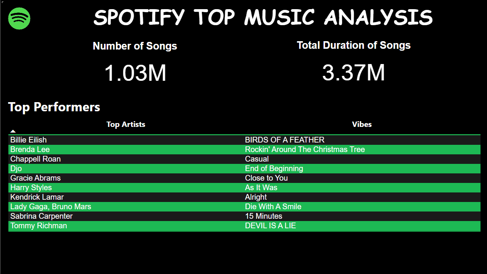
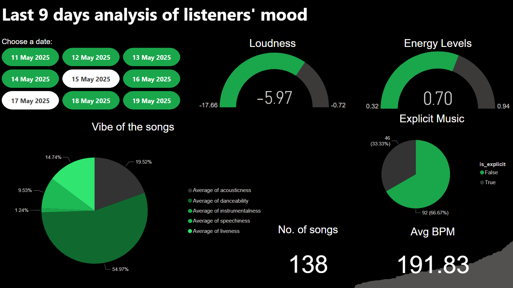
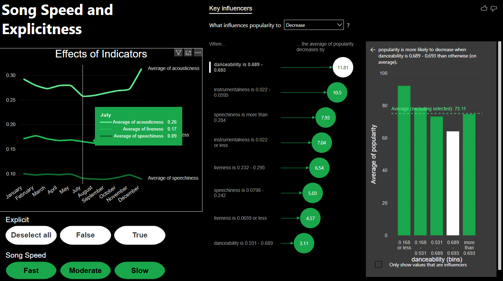
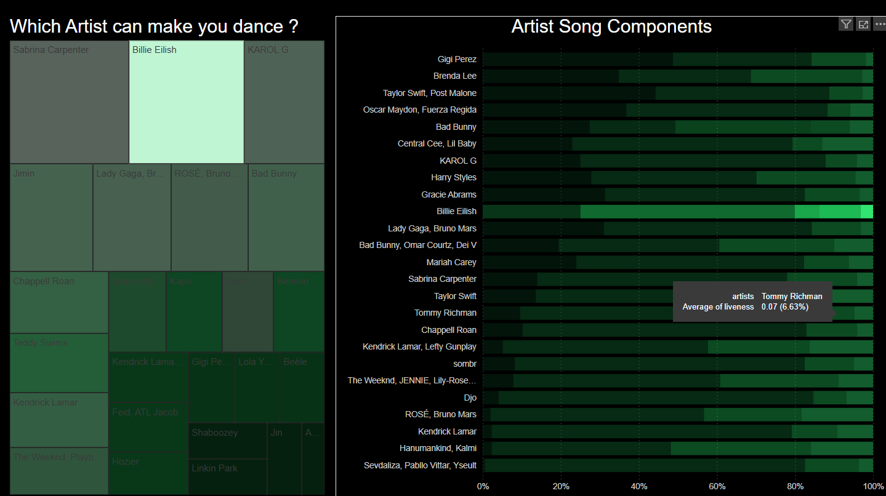

# SpotifyRecap
A 3-day self-learning project where I built an interactive Power BI dashboard to analyze Spotify data. It explores top artists, song trends, mood patterns, and audio features like danceability, instrumentalness, and loudness. Built from scratch using free resources, DAX, and Power BI , driven by curiosity and a love for music.

<h1>Welcome to my passion project!</h1> 
<h6>Over the course of 3 days, I set myself a challenge:
Learn Power BI from scratch
</h6>

<h3>What was the aim here ?</h3>
<ul>
  <li>Analyze something I love — Spotify</li>
  <li>Understand and apply DAX for calculated insights</li>
  <li>Build a professional-looking interactive dashboard</li>
  <li>Learn something new from scratch (via YouTube and other free resources)</li>
</ul> 

  
  

  
  

  <h2>🎧 Spotify Dashboard Visuals</h2>

  

    

      
      
Page 1: Overview & Top Artists

    

    

      
      
Page 2: Mood & Day-wise Analysis

    

    

      
      
Page 3: Audio Features vs Popularity

    

    

      
      
Page 4: Clean vs Explicit Songs

    

  

</body>
</html> 

<h3>Project Overview</h3>
The dashboard offers deep insights into Spotify music data and allows for interactive exploration of: 
<ul>
  <li>Top Artists & Trending Songs</li>
  <li>Mood Patterns Over 9 Days</li>
  <li>Loudness, Energy, and Explicit Content – and their impact on popularity</li>
  <li>Danceability, Tempo, Instrumentalness – and their correlation with listener preferences</li>
</ul>

<h3>Key Insights</h3>
Some fascinating patterns emerged from the analysis:
<ul>
  <li>Instrumentalness in a tight range boosts popularity by 23%</li>
  <li>Danceability leads listener moods with over 55% share</li>
  <li>Surprisingly, 66% of popular tracks are non-explicit</li>
</ul>

<h3>Tools & Techniques Used</h3>
<table>
  <thead>
    <tr>
      <th>Tool/Skill</th>
      <th>Purpose</th>
    </tr>
  </thead>
  <tbody>
    <tr>
      <td>Power BI</td>
      <td>Data visualization &amp; dashboard creation</td>
    </tr>
    <tr>
      <td>DAX</td>
      <td>Calculated columns &amp; custom measures</td>
    </tr>
    <tr>
      <td>Power Query (M)</td>
      <td>Data cleaning &amp; transformation</td>
    </tr>
    <tr>
      <td>YouTube + Blogs</td>
      <td>Self-learning resources</td>
    </tr>
    <tr>
      <td>Excel/CSV</td>
      <td>Initial data handling</td>
    </tr>
  </tbody>
</table>

<h3>How I Learned</h3>
This entire project was completed in 3 days, using only:
<ul>
  <li>Free YouTube tutorials</li>
  <li>Free study articles and websites</li>
  <li>AI helpers like ChatGPT</li>
  <li>A curious and consistent mindset</li>
</ul>

<b>No paid courses. Just curiosity, coffee, and determination!</b>

